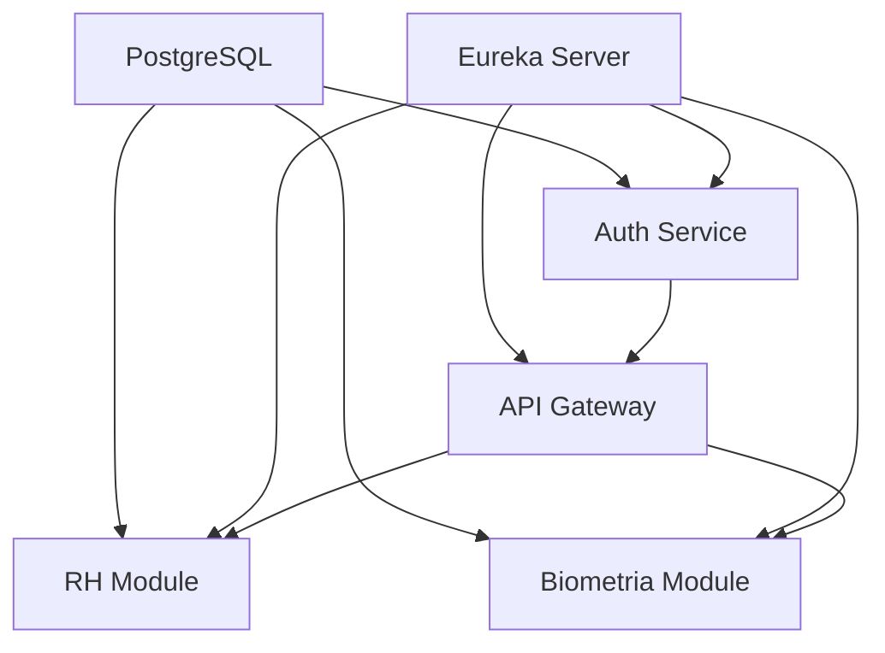

# Guia de Inicialização - MyERP

## 🚀 Inicialização Automática

### Método Rápido
```bash
# Iniciar tudo automaticamente
start-myerp.bat

# Parar tudo
stop-myerp.bat
```

## 📋 Ordem Manual de Inicialização

### Pré-requisitos
- ✅ Docker Desktop rodando
- ✅ Java 17+ instalado
- ✅ Maven 3.6+ instalado

### 1️⃣ PostgreSQL (Primeiro)
```bash
# Iniciar banco de dados
docker-compose up -d postgres pgadmin

# Verificar se está rodando
docker ps
```

### 2️⃣ Service Discovery - Eureka Server
```bash
cd infrastructure/service-discovery
mvn spring-boot:run
```
- **Porta:** 8761
- **URL:** http://localhost:8761
- **Função:** Registro e descoberta de serviços
- **Aguardar:** 30 segundos

### 3️⃣ Config Server (Opcional)
```bash
cd infrastructure/config-server
mvn spring-boot:run
```
- **Porta:** 8888
- **Função:** Configurações centralizadas
- **Aguardar:** 20 segundos

### 4️⃣ Auth Service
```bash
cd infrastructure/auth-service
mvn spring-boot:run
```
- **Porta:** 8081
- **Database:** auth_db (PostgreSQL)
- **Função:** Autenticação JWT
- **Aguardar:** 25 segundos

### 5️⃣ API Gateway
```bash
cd infrastructure/api-gateway
mvn spring-boot:run
```
- **Porta:** 8080
- **Função:** Roteamento e validação JWT
- **Aguardar:** 25 segundos

### 6️⃣ RH Module
```bash
cd modules/rh-module/sistema-ponto
mvn spring-boot:run
```
- **Porta:** 8082
- **Database:** rh_db (PostgreSQL)
- **Função:** Controle de ponto e funcionários
- **Aguardar:** 25 segundos

### 7️⃣ Biometria Module
```bash
cd modules/biometria-module
mvn spring-boot:run
```
- **Porta:** 8083
- **Database:** biometria_db (PostgreSQL)
- **Função:** Reconhecimento facial e ponto automático

## 🔗 URLs do Sistema

| Serviço | URL | Descrição |
|---------|-----|-----------|
| Eureka Dashboard | http://localhost:8761 | Monitoramento de serviços |
| API Gateway | http://localhost:8080 | Ponto de entrada principal |
| Auth Service | http://localhost:8081 | Autenticação direta |
| RH Module | http://localhost:8082 | Sistema de ponto direto |
| Biometria Module | http://localhost:8083 | Biometria direta |
| pgAdmin | http://localhost:5050 | Interface PostgreSQL |

## 🗄️ Databases PostgreSQL

| Módulo | Database | Tabelas Principais |
|--------|----------|-------------------|
| Auth Service | auth_db | users |
| RH Module | rh_db | funcionarios, registros_ponto |
| Biometria Module | biometria_db | evento_deteccao, sugestao_rh |

### Credenciais PostgreSQL
- **Host:** localhost:5432
- **Usuário:** myerp_user
- **Senha:** myerp_pass

### Credenciais pgAdmin
- **URL:** http://localhost:5050
- **Email:** admin@myerp.com
- **Senha:** admin123

## ⚠️ Dependências Entre Serviços



## 🔧 Troubleshooting

### Erro: "Port already in use"
```bash
# Ver processos usando a porta
netstat -ano | findstr :8080

# Matar processo
taskkill /f /pid <PID>
```

### Erro: "Connection refused" (PostgreSQL)
```bash
# Verificar se Docker está rodando
docker --version

# Iniciar PostgreSQL
docker-compose up -d postgres
```

### Erro: Eureka não encontrado
- Aguardar mais tempo para Eureka inicializar
- Verificar se porta 8761 está livre
- Reiniciar Eureka Server

### Erro: JWT inválido
- Verificar se Auth Service está rodando
- Confirmar se secret JWT é o mesmo em todos os serviços

## 📊 Monitoramento

### Logs dos Serviços
Cada serviço roda em janela separada com logs visíveis.

### Health Checks
```bash
# Verificar saúde dos serviços
curl http://localhost:8761/eureka/apps
curl http://localhost:8080/actuator/health
curl http://localhost:8081/actuator/health
```

### Métricas
- Eureka Dashboard: http://localhost:8761
- Actuator endpoints: `/actuator/health`, `/actuator/metrics`

## 🔄 Reinicialização

### Reiniciar Serviço Específico
1. Fechar janela do serviço (Ctrl+C)
2. Executar comando novamente

### Reiniciar Sistema Completo
```bash
stop-myerp.bat
start-myerp.bat
```

## 📝 Notas Importantes

1. **Ordem é crucial** - Eureka deve estar rodando antes dos outros serviços
2. **Aguardar inicialização** - Cada serviço precisa de tempo para registrar no Eureka
3. **PostgreSQL primeiro** - Banco deve estar rodando antes dos serviços
4. **Portas livres** - Verificar se portas não estão ocupadas
5. **Java/Maven** - Verificar se estão instalados e no PATH