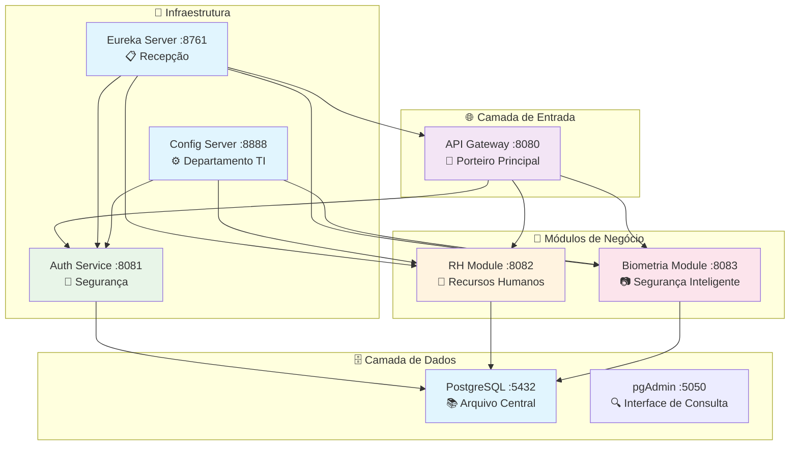
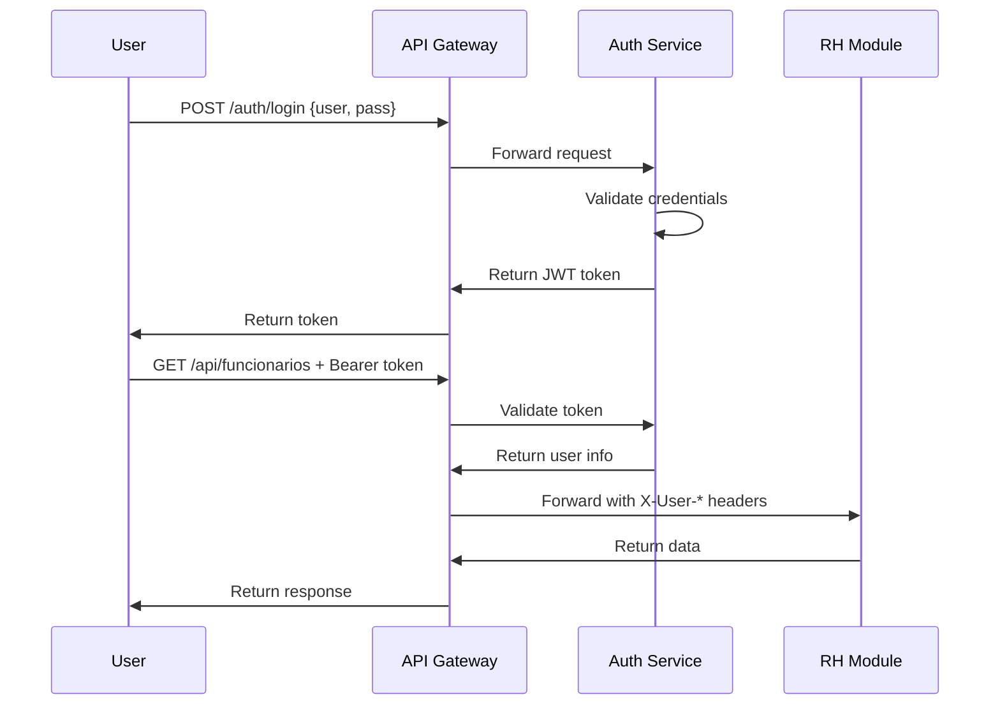

# Arquitetura do Sistema MyERP 🏢

## 🎭 Analogia Geral: Empresa Multinacional

Imagine o **MyERP** como uma **grande empresa multinacional** com várias filiais especializadas, todas trabalhando de forma coordenada.

## 🏗️ Visão Geral da Arquitetura



## 🏢 Departamentos da Empresa (Módulos)

### 🚪 **Porteiro Principal** (API Gateway)
- **Função:** Controla entrada de todos os visitantes
- **Responsabilidade:** Verificar credenciais e direcionar pessoas
- **Analogia:** Único ponto de entrada do prédio

### 📋 **Recepção** (Eureka Server)
- **Função:** Sabe onde cada departamento está localizado
- **Responsabilidade:** Registrar e localizar serviços
- **Analogia:** Lista telefônica interna da empresa

### ⚙️ **Departamento de TI** (Config Server)
- **Função:** Define padrões e configurações para toda empresa
- **Responsabilidade:** Distribuir regras e configurações
- **Analogia:** Manual de procedimentos corporativo

### 🔐 **Segurança Corporativa** (Auth Service)
- **Função:** Controla quem pode acessar o quê
- **Responsabilidade:** Autenticação e autorização
- **Analogia:** Departamento de segurança e crachás

### 👥 **Recursos Humanos** (RH Module)
- **Função:** Gerencia funcionários e controle de ponto
- **Responsabilidade:** CRUD funcionários, registros de ponto
- **Analogia:** Departamento de RH tradicional

### 📷 **Segurança Inteligente** (Biometria Module)
- **Função:** Reconhecimento facial e ponto automático
- **Responsabilidade:** Detecção, validação e alertas
- **Analogia:** Sistema de câmeras inteligentes

### 📚 **Arquivo Central** (PostgreSQL)
- **Função:** Armazena todos os documentos da empresa
- **Responsabilidade:** Persistência de dados
- **Analogia:** Arquivo físico da empresa

## 🔄 Fluxo de Comunicação Geral

### 1️⃣ **Inicialização da Empresa**
```
1. 📋 Recepção abre (Eureka Server)
2. ⚙️ TI define regras (Config Server)  
3. 🔐 Segurança se posiciona (Auth Service)
4. 🚪 Porteiro assume posto (API Gateway)
5. 👥 RH inicia operações (RH Module)
6. 📷 Câmeras ativadas (Biometria Module)
```

### 2️⃣ **Funcionário Chegando ao Trabalho**
```
1. 📷 Câmera detecta João Silva
2. 📷 Biometria → 👥 RH: "Registrar entrada de João"
3. 👥 RH → 📚 Arquivo: Salva registro de ponto
4. 📷 Biometria → 📧 Email: "João chegou às 8:05"
```

### 3️⃣ **Admin Consultando Relatórios**
```
1. 👤 Admin → 🚪 Porteiro: "Quero ver relatórios" + crachá
2. 🚪 Porteiro → 🔐 Segurança: "Este crachá é válido?"
3. 🔐 Segurança → 🚪 Porteiro: "Sim, é ADMIN"
4. 🚪 Porteiro → 👥 RH: "Admin quer relatórios"
5. 👥 RH → 📚 Arquivo: Busca dados
6. 👥 RH → 👤 Admin: Retorna relatórios
```

## 🔗 Matriz de Dependências

| Módulo | Depende de | Usado por |
|--------|------------|-----------|
| **Eureka Server** | - | Todos os outros |
| **Config Server** | Eureka | Todos os serviços |
| **Auth Service** | Eureka, Config, PostgreSQL | API Gateway |
| **API Gateway** | Eureka, Auth Service | Frontend, Mobile |
| **RH Module** | Eureka, Config, PostgreSQL | API Gateway, Biometria |
| **Biometria Module** | Eureka, Config, PostgreSQL, RH | Câmeras, Scheduler |
| **PostgreSQL** | - | Auth, RH, Biometria |

## 📊 Portas e Protocolos

| Serviço | Porta | Protocolo | Database |
|---------|-------|-----------|----------|
| PostgreSQL | 5432 | TCP | - |
| pgAdmin | 5050 | HTTP | - |
| Eureka Server | 8761 | HTTP | - |
| Config Server | 8888 | HTTP | - |
| API Gateway | 8080 | HTTP | - |
| Auth Service | 8081 | HTTP | auth_db |
| RH Module | 8082 | HTTP | rh_db |
| Biometria Module | 8083 | HTTP | biometria_db |

## 🔐 Fluxo de Segurança

### 🎫 **Autenticação JWT**


## 📈 Escalabilidade

### 🔄 **Horizontal Scaling**
- **Load Balancer** → Múltiplas instâncias do API Gateway
- **Database Sharding** → Separar dados por módulo
- **Cache Layer** → Redis para sessões JWT

### ⚡ **Performance**
- **Connection Pooling** → HikariCP para PostgreSQL
- **Async Processing** → Spring WebFlux onde aplicável
- **Circuit Breaker** → Hystrix para falhas em cascata

## 🛡️ Segurança

### 🔒 **Camadas de Segurança**
1. **Network:** Firewall e VPN
2. **Gateway:** Validação JWT
3. **Service:** Validação de roles
4. **Database:** Usuários específicos por serviço

### 🔐 **Boas Práticas**
- JWT com expiração curta
- Secrets em variáveis de ambiente
- HTTPS em produção
- Rate limiting no Gateway

## 📊 Monitoramento

### 📈 **Métricas**
- **Eureka Dashboard:** Status dos serviços
- **Actuator Endpoints:** Health checks
- **Database Monitoring:** pgAdmin
- **Application Logs:** Structured logging

### 🚨 **Alertas**
- Serviço DOWN no Eureka
- Alta latência no Gateway
- Falhas de autenticação
- Erros de banco de dados

## 🎯 Resumo da Analogia Completa

**MyERP** = **Empresa Multinacional Moderna**

- **🏢 Prédio Inteligente** com segurança automatizada
- **📋 Recepção Eficiente** que conhece todos os departamentos  
- **⚙️ TI Centralizada** que padroniza processos
- **🔐 Segurança Rigorosa** com controle de acesso
- **👥 RH Organizado** que gerencia pessoas
- **📷 Tecnologia Avançada** que automatiza tarefas
- **📚 Arquivo Digital** que guarda tudo com segurança

**Cada departamento tem sua especialidade, mas todos trabalham juntos para o sucesso da empresa!** 🏢✨