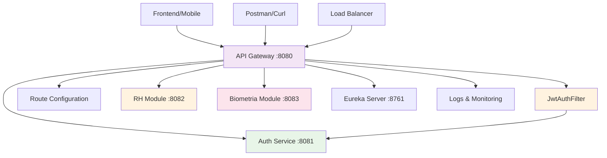

# API Gateway 🚪

## 🎭 Analogia: Porteiro de um Prédio Empresarial

Imagine o **API Gateway** como o **porteiro principal** de um prédio empresarial. Ele é o **único ponto de entrada** - todos que querem acessar qualquer empresa do prédio passam por ele primeiro.

### 🚪 Papel do Porteiro (API Gateway)
- **Controla entrada:** "Mostre seu crachá antes de entrar"
- **Direciona visitantes:** "RH? Vá para o 8º andar, sala 8082"
- **Verifica autorização:** "Você tem permissão para acessar essa área?"
- **Registra visitas:** "Anoto aqui que João visitou o RH às 14h30"

## 🎯 Função Principal
**Ponto Único de Entrada e Roteamento Inteligente**

### 📋 Responsabilidades
1. **Roteamento:** Direcionar requisições para serviços corretos
2. **Autenticação:** Validar JWT tokens
3. **Autorização:** Verificar permissões de acesso
4. **Injeção de Headers:** Adicionar informações do usuário
5. **Load Balancing:** Distribuir carga entre instâncias

## 🌟 Importância no Sistema
- **🔒 Segurança Centralizada:** Um ponto para validar tudo
- **🎯 Roteamento Inteligente:** Clientes não precisam saber endereços internos
- **📊 Monitoramento:** Logs centralizados de todas as requisições
- **⚡ Performance:** Cache e otimizações

## 🗺️ Mapa de Rotas

### 🔓 Rotas Públicas (sem autenticação)
```yaml
/auth/**  → Auth Service (8081)
  - POST /auth/login
  - POST /auth/validate  
  - POST /auth/users
```

### 🔐 Rotas Protegidas (requer JWT)
```yaml
/api/**   → RH Module (8082)
  - POST /api/pontos/{id}/registrar
  - GET  /api/pontos/{id}
  
/api/admin/** → RH Module (8082) [ADMIN only]
  - GET    /api/admin/funcionarios
  - POST   /api/admin/funcionarios
  - DELETE /api/admin/funcionarios/{id}
```

## 🔄 Fluxo de Relacionamento



## 🚦 Fluxo de Requisição

### 1️⃣ **Requisição Pública** (sem token)
```
1. Client → API Gateway: POST /auth/login
2. API Gateway: Verifica rota (/auth/** = público)
3. API Gateway → Auth Service: Encaminha requisição
4. Auth Service → API Gateway: Resposta com token
5. API Gateway → Client: Retorna resposta
```

### 2️⃣ **Requisição Protegida** (com token)
```
1. Client → API Gateway: GET /api/funcionarios + Authorization: Bearer <token>
2. API Gateway: Verifica rota (/api/** = protegido)
3. JwtAuthFilter: Valida token com Auth Service
4. API Gateway: Injeta headers X-User-Id, X-User-Login, X-User-Role
5. API Gateway → RH Module: Requisição com headers
6. RH Module → API Gateway: Resposta
7. API Gateway → Client: Retorna resposta
```

### 3️⃣ **Requisição Admin** (requer role ADMIN)
```
1. Client → API Gateway: GET /api/admin/funcionarios + Authorization: Bearer <token>
2. JwtAuthFilter: Valida token
3. API Gateway: Verifica se role = ADMIN
4. Se ADMIN: Encaminha para RH Module
5. Se não ADMIN: Retorna 403 Forbidden
```

## 🔐 Filtro JWT (JwtAuthFilter)

### 🎫 Validação de Token
```java
1. Extrai token do header Authorization
2. Chama Auth Service para validar
3. Se válido: Injeta headers do usuário
4. Se inválido: Retorna 401 Unauthorized
```

### 📋 Headers Injetados
```http
X-User-Id: 1
X-User-Login: admin
X-User-Role: ADMIN
```

## ⚙️ Configuração de Rotas

```yaml
spring:
  cloud:
    gateway:
      routes:
        # Rota pública
        - id: auth-service
          uri: http://localhost:8081
          predicates:
            - Path=/auth/**
        
        # Rota protegida
        - id: rh-service
          uri: http://localhost:8082
          predicates:
            - Path=/api/**
          filters:
            - name: JwtAuthFilter
            - StripPrefix=1
```

## 📊 Monitoramento e Logs

### 🔍 Logs Estruturados
```
[JWT] Token válido para usuário: admin
[ROUTE] Roteando /api/funcionarios → RH-SERVICE
[ADMIN_ACCESS] Acesso admin concedido para: admin
```

### 📈 Métricas
- Requisições por segundo
- Tempo de resposta médio
- Taxa de erro por rota
- Uso de cada serviço

## ⚠️ Pontos Críticos

### 🔑 **JWT Secret**
- Deve ser idêntico ao Auth Service
- Nunca expor em logs

### 🎯 **Ordem de Inicialização**
- Auth Service deve estar rodando
- Eureka Server para descoberta de serviços

### 🔄 **Circuit Breaker**
- Implementar para evitar cascata de falhas
- Timeout configurado para cada rota

## 🛠️ Troubleshooting

### Problema: "401 Unauthorized"
**Soluções:**
- Verificar formato do token: `Bearer <token>`
- Confirmar se Auth Service está respondendo
- Validar secret JWT

### Problema: "503 Service Unavailable"
**Soluções:**
- Verificar se serviço de destino está rodando
- Confirmar registro no Eureka
- Checar conectividade de rede

### Problema: "404 Not Found"
**Soluções:**
- Verificar configuração de rotas
- Confirmar predicates (Path)
- Validar URI de destino

## 🎯 Resumo da Analogia

**API Gateway** = **Porteiro do Prédio**
- **Único ponto de entrada** para todo o sistema
- **Verifica credenciais** antes de permitir acesso
- **Direciona visitantes** para o departamento correto
- **Controla permissões** (quem pode ir onde)
- **Registra todas as visitas** para auditoria

**Sem o porteiro, seria um caos - qualquer um entraria em qualquer lugar!** 🚪✨