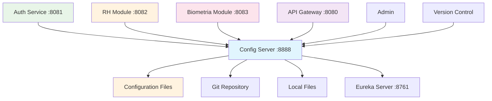

# Config Server ⚙️

## 🎭 Analogia: Departamento de TI Corporativo

Imagine o **Config Server** como o **departamento de TI** de uma grande empresa. Ele é responsável por definir e distribuir todas as **configurações padrão** para todas as filiais (microserviços).

### 💻 Papel do Departamento de TI (Config Server)
- **Define padrões:** "Todas as filiais usarão a mesma senha do banco"
- **Distribui configurações:** "Enviei as novas configurações para todos"
- **Centraliza mudanças:** "Mudei em um lugar, todos receberam"
- **Mantém consistência:** "Todos seguem as mesmas regras"

## 🎯 Função Principal
**Centralização e Distribuição de Configurações**

### 📋 Responsabilidades
1. **Armazenar Configurações:** Manter configs centralizadas
2. **Distribuir Configs:** Enviar para todos os serviços
3. **Versionamento:** Controlar mudanças nas configurações
4. **Ambientes:** Separar configs de dev/test/prod
5. **Atualização Dinâmica:** Mudar configs sem restart

## 🌟 Importância no Sistema
- **🎯 Centralização:** Uma fonte única da verdade
- **🔄 Consistência:** Todos usam mesmas configurações
- **⚡ Agilidade:** Mudanças instantâneas
- **🔐 Segurança:** Configs sensíveis centralizadas

## 🗂️ Estrutura de Configurações

### 📁 Organização de Arquivos
```
config/
├── application.yml          # Configurações globais
├── auth-service.yml         # Específicas do Auth Service
├── rh-service.yml           # Específicas do RH Module
├── biometria-service.yml    # Específicas do Biometria
└── api-gateway.yml          # Específicas do Gateway
```

### 🌍 Por Ambiente
```
config/
├── application-dev.yml      # Desenvolvimento
├── application-test.yml     # Testes
├── application-prod.yml     # Produção
```

## 🔄 Fluxo de Relacionamento



## 🚦 Fluxo de Configuração

### 1️⃣ **Inicialização de Serviço**
```
1. Auth Service inicia
2. Auth Service → Config Server: "Preciso das minhas configurações"
3. Config Server: Busca auth-service.yml + application.yml
4. Config Server → Auth Service: Envia todas as configs
5. Auth Service: Aplica configurações e continua inicialização
```

### 2️⃣ **Atualização Dinâmica**
```
1. Admin: Altera configuração no Config Server
2. Config Server: Notifica mudança
3. Serviços: Recebem nova configuração
4. Serviços: Aplicam mudanças sem restart
```

### 3️⃣ **Consulta de Configuração**
```
GET /auth-service/default
Response: Todas as configurações do Auth Service
```

## 📡 Endpoints Principais

### 🔍 **Consulta de Configurações**
```http
GET /{service}/{profile}           # Config de um serviço
GET /{service}/{profile}/{label}   # Config com versão específica
GET /application/default           # Configurações globais
```

### 📊 **Exemplos de Uso**
```http
GET /auth-service/default          # Configs do Auth Service
GET /rh-service/prod              # Configs do RH em produção
GET /application/default          # Configs compartilhadas
```

## ⚙️ Configurações Centralizadas

### 🗄️ **PostgreSQL Comum**
```yaml
# application.yml - Para todos os serviços
spring:
  datasource:
    driver-class-name: org.postgresql.Driver
    username: myerp_user
    password: myerp_pass
  jpa:
    hibernate:
      ddl-auto: update
    database-platform: org.hibernate.dialect.PostgreSQLDialect
```

### 🔐 **JWT Comum**
```yaml
# application.yml - Secret compartilhado
jwt:
  secret: minhachavesecretasuperseguraparaojwt123456789
  expiration: 86400000
```

### 🏢 **Eureka Comum**
```yaml
# application.yml - Configuração Eureka para todos
eureka:
  client:
    service-url:
      defaultZone: http://localhost:8761/eureka/
```

## 🎯 Configurações Específicas

### 🔐 **Auth Service**
```yaml
# auth-service.yml
spring:
  datasource:
    url: jdbc:postgresql://localhost:5432/auth_db
server:
  port: 8081
```

### 👥 **RH Module**
```yaml
# rh-service.yml
spring:
  datasource:
    url: jdbc:postgresql://localhost:5432/rh_db
server:
  port: 8082
```

## 🔄 Modos de Armazenamento

### 📁 **Native (Arquivos Locais)**
```yaml
spring:
  cloud:
    config:
      server:
        native:
          search-locations: classpath:/config
  profiles:
    active: native
```

### 🌐 **Git Repository**
```yaml
spring:
  cloud:
    config:
      server:
        git:
          uri: https://github.com/empresa/myerp-config
          default-label: main
```

## 🔄 Refresh Automático

### 🔄 **Spring Cloud Bus**
```yaml
# Para atualização automática
management:
  endpoints:
    web:
      exposure:
        include: refresh,bus-refresh
```

### 📡 **Webhook**
```bash
# Atualizar configurações
POST /actuator/bus-refresh
```

## 📊 Monitoramento

### 🔍 **Health Check**
```http
GET /actuator/health
Response: {"status": "UP"}
```

### 📈 **Métricas**
```http
GET /actuator/metrics
# Quantas configurações foram servidas
# Tempo de resposta médio
# Erros de configuração
```

## ⚠️ Pontos Críticos

### 🔑 **Segurança**
- Configurações sensíveis (senhas, secrets)
- Criptografia de dados sensíveis
- Controle de acesso ao repositório

### 🔄 **Disponibilidade**
- Config Server deve estar sempre disponível
- Backup das configurações
- Fallback para configs locais

### 📝 **Versionamento**
- Controle de mudanças
- Rollback de configurações
- Auditoria de alterações

## 🛠️ Troubleshooting

### Problema: "Config não encontrada"
**Soluções:**
- Verificar nome do arquivo de configuração
- Confirmar profile ativo
- Validar search-locations

### Problema: "Serviço não conecta ao Config Server"
**Soluções:**
- Verificar se Config Server está rodando
- Confirmar URL de conexão
- Validar bootstrap.yml do serviço

### Problema: "Configurações não atualizaram"
**Soluções:**
- Chamar /actuator/refresh
- Verificar se @RefreshScope está presente
- Confirmar se mudança foi commitada

## 🎯 Resumo da Analogia

**Config Server** = **Departamento de TI Corporativo**
- **Define padrões** para toda a empresa
- **Distribui configurações** para todas as filiais
- **Centraliza mudanças** em um só lugar
- **Mantém consistência** entre todos os sistemas
- **Facilita manutenção** e atualizações

**É como ter um manual de procedimentos que se atualiza automaticamente em todas as filiais!** ⚙️✨

## 🚀 Benefícios Práticos

### ✅ **Sem Config Server**
- Cada serviço tem seu application.yml
- Mudança de senha = alterar 5 arquivos
- Inconsistências entre ambientes
- Deploy complexo

### ✅ **Com Config Server**
- Uma mudança = todos recebem
- Configurações consistentes
- Deploy simplificado
- Controle centralizado