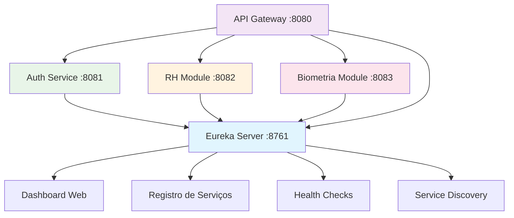

# Service Discovery (Eureka Server) 🏢

## 🎭 Analogia: Recepção de um Grande Prédio Empresarial

Imagine um **prédio empresarial** com várias empresas (microserviços). O **Eureka Server** é como a **recepcionista principal** no térreo.

### 👩‍💼 Papel da Recepcionista (Eureka)
- **Registra visitantes:** "Olá, sou o RH-SERVICE, estou na sala 8082"
- **Informa localização:** "O Auth-Service? Está na sala 8081"
- **Monitora presença:** "João, você ainda está aí? Confirme a cada 30 segundos"
- **Remove ausentes:** "Maria não responde há 90 segundos, vou removê-la da lista"

## 🎯 Função Principal
**Descoberta e Registro de Serviços**

### 📋 Responsabilidades
1. **Registro:** Serviços se cadastram ao iniciar
2. **Descoberta:** Outros serviços consultam onde encontrar alguém
3. **Monitoramento:** Verifica se serviços estão vivos (health check)
4. **Balanceamento:** Distribui chamadas entre instâncias

## 🌟 Importância no Sistema
- **🔗 Conectividade:** Sem ele, serviços não se encontram
- **🔄 Flexibilidade:** Serviços podem mudar de endereço
- **📊 Monitoramento:** Dashboard visual do sistema
- **⚡ Performance:** Cache de localizações

## 🔄 Fluxo de Relacionamento



## 🚦 Fluxo de Comunicação

### 1️⃣ **Inicialização** (Ordem Crítica)
```
1. Eureka Server inicia (8761)
2. Outros serviços iniciam e se registram
3. API Gateway consulta lista de serviços
```

### 2️⃣ **Registro de Serviço**
```
RH Module → Eureka: "Oi, sou RH-SERVICE em localhost:8082"
Eureka → RH Module: "Registrado! Confirme a cada 30s"
```

### 3️⃣ **Descoberta de Serviço**
```
API Gateway → Eureka: "Onde está o RH-SERVICE?"
Eureka → API Gateway: "RH-SERVICE está em localhost:8082"
```

### 4️⃣ **Health Check**
```
Eureka → RH Module: "Você está vivo?"
RH Module → Eureka: "Sim, ainda estou aqui!"
```

## 📊 Métricas e Monitoramento

### Dashboard (http://localhost:8761)
- **Serviços Registrados:** Lista completa
- **Status:** UP/DOWN de cada serviço
- **Instâncias:** Quantas cópias de cada serviço
- **Última Renovação:** Quando foi o último "estou vivo"

## ⚠️ Pontos Críticos

### 🚨 **DEVE ser o primeiro a iniciar**
- Outros serviços dependem dele para se registrar
- Sem Eureka = serviços não se encontram

### 🔄 **Configurações Importantes**
```yaml
eureka:
  server:
    enable-self-preservation: false  # Para desenvolvimento
    eviction-interval-timer-in-ms: 4000  # Remove serviços mortos rapidamente
```

## 🛠️ Troubleshooting

### Problema: "Serviço não aparece no dashboard"
**Solução:** Verificar se serviço tem `@EnableEurekaClient`

### Problema: "Serviços não se encontram"
**Solução:** Verificar se Eureka está rodando primeiro

### Problema: "Serviços aparecem como DOWN"
**Solução:** Verificar health checks e network

## 🎯 Resumo da Analogia

**Eureka Server** = **Recepcionista do Prédio**
- **Conhece todos** os inquilinos (serviços)
- **Informa localização** quando perguntado
- **Monitora presença** constantemente
- **Essencial para funcionamento** do prédio inteiro

**Sem a recepcionista, ninguém se encontra no prédio!** 🏢✨