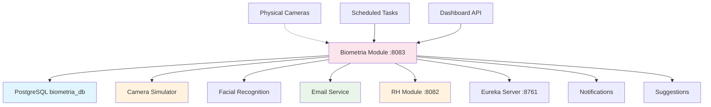

# Biometria Module 📷

## 🎭 Analogia: Sistema de Segurança com Reconhecimento Facial

Imagine o **Biometria Module** como um **sistema de segurança inteligente** instalado na entrada da empresa. Ele tem câmeras que reconhecem o rosto dos funcionários e automaticamente registra o ponto.

### 🎥 Papel do Sistema de Segurança (Biometria)
- **Reconhece rostos:** "Detectei João Silva com 95% de confiança"
- **Registra automaticamente:** "João chegou às 8:05, vou registrar entrada"
- **Detecta inconsistências:** "Maria saiu às 11:30, muito cedo para almoço"
- **Alerta RH:** "Pedro não bateu ponto de retorno do almoço"

## 🎯 Função Principal
**Controle de Ponto Automático via Reconhecimento Facial**

### 📋 Responsabilidades
1. **Detecção Facial:** Reconhecer funcionários por câmeras
2. **Registro Automático:** Bater ponto sem intervenção manual
3. **Validação de Horários:** Verificar se está no horário correto
4. **Sugestões para RH:** Criar alertas para inconsistências
5. **Notificações:** Enviar emails sobre irregularidades

## 🌟 Importância no Sistema
- **🤖 Automação:** Elimina necessidade de cartão/digital
- **⏰ Precisão:** Registra exato momento da detecção
- **🔍 Monitoramento:** Detecta padrões e inconsistências
- **📧 Alertas:** Notifica RH sobre problemas

## 🗄️ Estrutura do Banco (biometria_db)

### Tabela: evento_deteccao
```sql
CREATE TABLE evento_deteccao (
    id BIGINT PRIMARY KEY,
    funcionario_id BIGINT,
    nome_funcionario VARCHAR(255),
    data_hora TIMESTAMP,
    tipo_movimento VARCHAR(255) CHECK (tipo_movimento IN ('ENTRADA','SAIDA','SAIDA_ALMOCO','RETORNO_ALMOCO')),
    confianca DOUBLE,
    processado BOOLEAN DEFAULT FALSE
);
```

### Tabela: sugestao_rh
```sql
CREATE TABLE sugestao_rh (
    id BIGINT PRIMARY KEY,
    funcionario_id BIGINT,
    nome_funcionario VARCHAR(255),
    data_hora TIMESTAMP,
    tipo_movimento VARCHAR(255),
    motivo VARCHAR(255),
    status VARCHAR(255) DEFAULT 'PENDENTE',
    observacoes TEXT
);
```

## 🔄 Fluxo de Relacionamento



## 🚦 Fluxos de Operação

### 1️⃣ **Detecção Facial Automática**
```
1. Câmera: Detecta movimento na entrada
2. OpenCV: Processa imagem e reconhece rosto
3. Biometria: Identifica "João Silva" com 92% confiança
4. Biometria: Determina tipo (ENTRADA baseado no horário 8:05)
5. Biometria: Cria EventoDeteccao no banco
6. Biometria: Processa detecção
```

### 2️⃣ **Processamento de Detecção**
```
1. Biometria: Verifica horário vs tolerância
2. Se dentro da tolerância (±15min):
   - Chama RH Module para registrar ponto automaticamente
   - Marca evento como processado
3. Se fora da tolerância:
   - Cria SugestaoRH para validação manual
   - Envia email para RH
```

### 3️⃣ **Simulação para Testes**
```
1. API Call: POST /api/biometria/simular-deteccao?nome=João&movimento=ENTRADA
2. Biometria: Cria evento simulado com alta confiança (95%)
3. Biometria: Processa como detecção real
4. Console: "🎥 SIMULAÇÃO: João Silva - ENTRADA (95.0%)"
```

### 4️⃣ **Dashboard e Relatórios**
```
1. Admin: GET /api/biometria/dashboard
2. Biometria: Calcula estatísticas
3. Response: {
     "eventosHoje": 25,
     "sugestoesPendentes": 3,
     "taxaAutomatizacao": 89.5%
   }
```

## 📡 Endpoints Principais

### 🎥 **Simulação e Testes**
```http
POST /api/biometria/simular-deteccao    # Simular detecção facial
GET  /api/biometria/eventos             # Listar eventos de detecção
GET  /api/biometria/eventos/pendentes   # Eventos não processados
```

### 📊 **Dashboard e Relatórios**
```http
GET /api/biometria/dashboard            # Estatísticas gerais
GET /api/biometria/sugestoes            # Sugestões para RH
PUT /api/biometria/sugestoes/{id}       # Aprovar/rejeitar sugestão
```

## 🤖 Simulador de Câmera

### 🎬 Funcionamento Automático
```java
@Scheduled(fixedRate = 30000) // A cada 30 segundos
public void simularDeteccaoFacial() {
    // Simula mais detecções nos horários de pico:
    // 07:00-09:00: 70% chance (entrada)
    // 11:00-13:00: 50% chance (almoço)
    // 17:00-19:00: 60% chance (saída)
}
```

### 👥 Funcionários Simulados
```java
List<String> funcionarios = Arrays.asList(
    "João Silva", "Maria Santos", "Pedro Oliveira", 
    "Ana Costa", "Carlos Lima"
);
```

## ⏰ Tolerâncias de Horário

### 📅 Horários Padrão
```yaml
horarios-padrao:
  entrada: "08:00"        # Tolerância: 07:45 - 08:15
  saida-almoco: "12:00"   # Tolerância: 11:45 - 12:15
  retorno-almoco: "13:00" # Tolerância: 12:45 - 13:15
  saida: "17:00"          # Tolerância: 16:45 - 17:15
```

### 🎯 Lógica de Processamento
- **Dentro da tolerância:** Registro automático
- **Fora da tolerância:** Sugestão para RH validar

## 📧 Sistema de Notificações

### 📨 Emails Automáticos
```
Para: rh@empresa.com
Assunto: [BIOMETRIA] Inconsistência detectada - João Silva
Corpo: 
  Funcionário: João Silva
  Horário: 11:30 (Saída Almoço)
  Problema: Muito cedo (esperado: 12:00 ±15min)
  Ação: Aguardando validação do RH
```

## 🔧 Configurações Principais

```yaml
biometria:
  camera:
    enabled: false              # true = câmera real, false = simulador
    confidence-threshold: 0.8   # Mínimo 80% confiança
  
  tolerancia:
    entrada: 15    # ±15 minutos
    saida: 15
    almoco: 15
  
  email:
    enabled: true  # Enviar notificações
```

## 📊 Logs Coloridos

```
🎥 SIMULAÇÃO: João Silva - ENTRADA (95.0%)
✅ PONTO AUTOMÁTICO: Maria Santos registrada às 08:05
⏰ SUGESTÃO RH: Pedro Oliveira - Entrada às 07:30 (muito cedo)
📧 EMAIL ENVIADO: Notificação para RH sobre Ana Costa
⚠️ INCONSISTÊNCIA: Carlos Lima - Sem retorno do almoço
```

## 🔮 Funcionalidades Futuras

### 🎯 Em Desenvolvimento
- **Câmera Real:** Integração com OpenCV
- **Reconhecimento Facial:** Algoritmos de ML
- **Interface Web:** Dashboard para RH
- **WhatsApp:** Notificações via API

### 🚀 Melhorias Planejadas
- **Múltiplas Câmeras:** Entrada, saída, refeitório
- **Detecção de Máscara:** Compliance COVID
- **Relatórios Avançados:** Analytics e insights
- **Mobile App:** Notificações push

## ⚠️ Pontos Críticos

### 🎥 **Câmeras**
- Atualmente usa simulador para testes
- Integração real requer OpenCV configurado

### 📧 **Email**
- Configurado para simulação (logs)
- Produção requer SMTP real

### 🔄 **Integração RH**
- Chama endpoints do RH Module
- Requer API Gateway funcionando

## 🛠️ Troubleshooting

### Problema: "Simulação não funciona"
**Soluções:**
- Verificar se scheduler está habilitado
- Confirmar horário atual vs horários de pico

### Problema: "Emails não enviados"
**Soluções:**
- Verificar configuração SMTP
- Confirmar se email service está ativo

## 🎯 Resumo da Analogia

**Biometria Module** = **Sistema de Segurança Inteligente**
- **Reconhece funcionários** automaticamente
- **Registra ponto** sem intervenção manual
- **Detecta inconsistências** e alerta RH
- **Monitora padrões** de comportamento
- **Automatiza processos** repetitivos

**É como ter um segurança que nunca dorme e lembra de tudo!** 📷✨