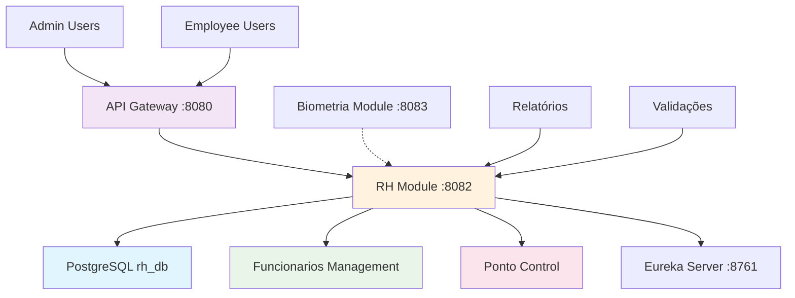

# RH Module (Sistema Ponto) 👥

## 🎭 Analogia: Departamento de Recursos Humanos

Imagine o **RH Module** como o **departamento de RH** de uma empresa real. Ele cuida de tudo relacionado aos funcionários: contratação, controle de ponto, folha de pagamento, etc.

### 👩💼 Papel do RH (RH Module)
- **Gerencia funcionários:** "Vamos contratar João Silva para a vaga"
- **Controla ponto:** "Maria bateu ponto às 8:05 - entrada registrada"
- **Monitora horários:** "Pedro saiu para almoço às 12:15"
- **Relatórios:** "Quantas horas João trabalhou este mês?"

## 🎯 Função Principal
**Gestão Completa de Recursos Humanos e Controle de Ponto**

### 📋 Responsabilidades
1. **CRUD Funcionários:** Criar, listar, atualizar, remover
2. **Controle de Ponto:** Registrar entrada/saída/almoço
3. **Relatórios de Ponto:** Consultar histórico de registros
4. **Controle de Acesso:** Funcionários vs Administradores
5. **Validação de Horários:** Verificar consistência dos registros

## 🌟 Importância no Sistema
- **👥 Gestão de Pessoas:** Core business do RH
- **⏰ Controle de Jornada:** Compliance trabalhista
- **📊 Relatórios Gerenciais:** Dados para tomada de decisão
- **🔐 Segurança:** Controle baseado em roles

## 🗄️ Estrutura do Banco (rh_db)

### Tabela: funcionarios
```sql
CREATE TABLE funcionarios (
    id BIGINT PRIMARY KEY,
    nome VARCHAR(255),
    cpf VARCHAR(255) UNIQUE,
    login VARCHAR(255) UNIQUE,
    senha VARCHAR(255),
    role VARCHAR(255) CHECK (role IN ('FUNCIONARIO','ADMIN'))
);
```

### Tabela: registros_ponto
```sql
CREATE TABLE registros_ponto (
    id BIGINT PRIMARY KEY,
    funcionario_id BIGINT REFERENCES funcionarios(id),
    tipo VARCHAR(255) CHECK (tipo IN ('ENTRADA','SAIDA','SAIDA_ALMOCO','RETORNO_ALMOCO')),
    data_hora TIMESTAMP,
    observacoes TEXT
);
```

## 🔄 Fluxo de Relacionamento



## 🚦 Fluxos de Operação

### 1️⃣ **Registro de Ponto** (Funcionário)
```
1. Funcionário → API Gateway: POST /api/pontos/1/registrar
2. API Gateway: Valida JWT + injeta headers X-User-*
3. API Gateway → RH Module: Requisição com headers
4. RH Module: Verifica se user pode registrar ponto do funcionário 1
5. RH Module: Cria registro na tabela registros_ponto
6. RH Module → Funcionário: "Ponto registrado às 08:30"
```

### 2️⃣ **Consulta de Pontos** (Funcionário)
```
1. Funcionário → API Gateway: GET /api/pontos/1
2. API Gateway: Valida JWT + injeta X-User-Id=1
3. RH Module: Busca registros WHERE funcionario_id = 1
4. RH Module → Funcionário: Lista de registros do próprio funcionário
```

### 3️⃣ **Gestão de Funcionários** (Admin)
```
1. Admin → API Gateway: POST /api/admin/funcionarios
2. API Gateway: Valida JWT + verifica role=ADMIN
3. RH Module: Verifica header X-User-Role = ADMIN
4. RH Module: Cria funcionário na tabela funcionarios
5. RH Module → Admin: "Funcionário criado com sucesso"
```

### 4️⃣ **Relatórios Administrativos** (Admin)
```
1. Admin → API Gateway: GET /api/admin/pontos
2. RH Module: Verifica permissão ADMIN
3. RH Module: Busca TODOS os registros de ponto
4. RH Module → Admin: Relatório completo
```

## 📡 Endpoints Principais

### 👤 **Funcionários** (requer autenticação)
```http
POST /pontos/{id}/registrar    # Registrar ponto
GET  /pontos/{id}              # Consultar próprios pontos
```

### 👑 **Administradores** (requer role ADMIN)
```http
GET    /admin/funcionarios     # Listar todos funcionários
POST   /admin/funcionarios     # Criar funcionário
DELETE /admin/funcionarios/{id} # Remover funcionário
GET    /admin/pontos           # Ver todos os pontos
DELETE /admin/pontos/{id}      # Remover registro de ponto
```

## 📊 Exemplos de Uso

### Registrar Ponto
```json
POST /api/pontos/1/registrar
Headers: X-User-Id: 1, X-User-Role: FUNCIONARIO

Response:
{
  "id": 15,
  "funcionario": "João Silva",
  "tipo": "ENTRADA",
  "dataHora": "2024-01-15T08:30:00",
  "observacoes": null
}
```

### Criar Funcionário (Admin)
```json
POST /api/admin/funcionarios
Headers: X-User-Role: ADMIN

{
  "nome": "Maria Santos",
  "cpf": "12345678901",
  "login": "maria",
  "senha": "123456",
  "role": "FUNCIONARIO"
}
```

## 🔐 Controle de Acesso

### 🎫 Headers Recebidos do Gateway
```http
X-User-Id: 1
X-User-Login: joao
X-User-Role: FUNCIONARIO
```

### 🛡️ Validações de Segurança
- **Funcionário:** Só pode ver/registrar próprios pontos
- **Admin:** Pode ver/gerenciar tudo
- **Verificação:** `if (!userRole.equals("ADMIN")) return 403`

## 📋 Tipos de Registro de Ponto

```java
enum TipoPonto {
    ENTRADA,        // 08:00
    SAIDA_ALMOCO,   // 12:00
    RETORNO_ALMOCO, // 13:00
    SAIDA           // 17:00
}
```

## 📊 Logs Estruturados

```
[REGISTRAR_PONTO] Funcionário ID: 1, Tipo: ENTRADA
[ADMIN_CRIAR_FUNCIONARIO] Admin: admin criou funcionário: Maria
[LISTAR_PONTOS] Funcionário 1 consultou próprios registros
[ADMIN_ACCESS_DENIED] Usuário funcionario tentou acessar área admin
```

## ⚠️ Pontos Críticos

### 🗄️ **Banco de Dados**
- PostgreSQL deve estar rodando
- Tabelas criadas automaticamente pelo Hibernate

### 🔐 **Segurança**
- Headers X-User-* são essenciais
- Validação de role para endpoints admin

### 🔄 **Integração**
- Biometria Module pode chamar endpoints de ponto
- API Gateway injeta headers de usuário

## 🛠️ Troubleshooting

### Problema: "403 Forbidden"
**Soluções:**
- Verificar se header X-User-Role está presente
- Confirmar se usuário tem permissão ADMIN
- Validar JWT no API Gateway

### Problema: "Funcionário não encontrado"
**Soluções:**
- Verificar se ID existe na tabela funcionarios
- Confirmar se usuário pode acessar esse funcionário

## 🎯 Resumo da Analogia

**RH Module** = **Departamento de RH da Empresa**
- **Gerencia funcionários** (contratação, demissão)
- **Controla ponto** (entrada, saída, almoço)
- **Gera relatórios** para gestão
- **Aplica regras** de acesso e permissões
- **Mantém histórico** de todas as atividades

**É o coração da gestão de pessoas na empresa!** 👥✨